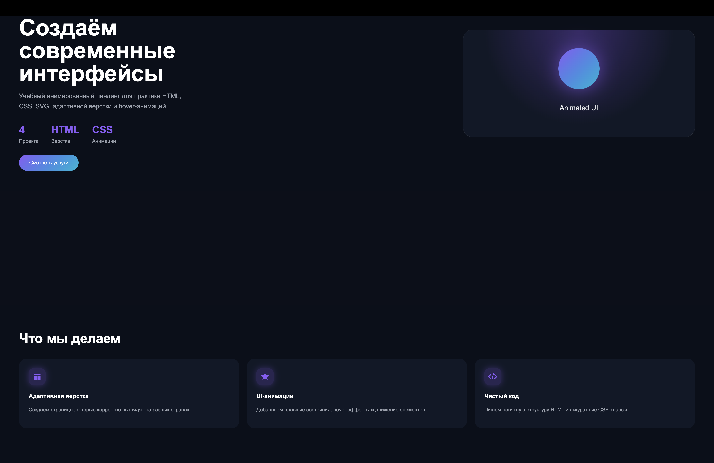

# Animated Landing Page

Мой учебный проект по Frontend-разработке.

В этом проекте я практиковался в создании адаптивного лендинга с использованием HTML и CSS.

## Что использовал

* HTML5
* CSS3
* Flexbox
* Grid
* SVG-иконки

## Что получилось

* адаптивная верстка;
* блок услуг с карточками;
* SVG-иконки из отдельной папки;
* hover-эффекты;
* анимация карточки в Hero-блоке;
* секция с этапами работы.

## Структура проекта

* index.html
* style.css
* main.js
* папка svg с иконками

## Что изучал во время проекта

Во время работы над проектом закреплял:

* семантическую верстку;
* Flexbox;
* Grid;
* SVG;
* адаптивность через media-запросы;
* организацию структуры проекта.

## Автор

Chuka_man

Начинающий Frontend-разработчик.
